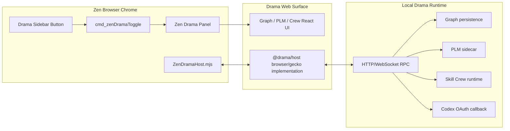

# Drama in Zen Browser Embedding Plan

## Goal

Embed Drama into the local Zen Browser fork using Zen's browser chrome UI instead of Electron.

This does not mean rewriting Drama Graph, Drama PLM, and Skill Crew as XUL. The right target is:

- Zen owns the outer shell: sidebar button, command, panel frame, theme, window lifecycle.
- Drama owns the working surface: React Graph / PLM / Crew UI loaded inside a Zen-hosted browser panel.
- A local Drama runtime owns filesystem, Graph persistence, PLM sidecar, OAuth callback, and Crew execution over HTTP/WebSocket.

## Zen Findings

The local Zen source is at:

`C:\Users\gengr\Downloads\open-source-clients\zen-browser`

Relevant integration points:

- `src/browser/base/content/browser-xhtml.patch`
  - Adds `zen-preloaded.inc.xhtml`, `zen-assets.inc.xhtml`, and wraps Firefox content in `#zen-main-app-wrapper`.
- `src/browser/base/content/browser-box-inc-xhtml.patch`
  - Adds `#zen-appcontent-wrapper`, `#zen-appcontent-navbar-wrapper`, and `#zen-tabbox-wrapper`.
- `src/browser/base/content/zen-assets.inc.xhtml`
  - Loads Zen global CSS and `ZenPreloadedScripts.js`.
- `src/zen/common/ZenPreloadedScripts.js`
  - Imports Zen feature managers such as `ZenUIManager`, `ZenViewSplitter`, `ZenGlanceManager`.
- `src/browser/base/content/zen-sidebar-icons.inc.xhtml`
  - Defines the bottom sidebar toolbar button area.
- `src/browser/base/content/zen-commands.inc.xhtml`
  - Defines Zen command IDs.
- `src/browser/base/content/zen-assets.jar.inc.mn`
  - Includes each Zen feature's `jar.inc.mn`.
- `src/zen/common/styles/zen-theme.css`
  - Defines theme variables: `--zen-border-radius`, `--zen-primary-color`, `--zen-colors-*`, `--zen-main-browser-background`, `--zen-element-separation`.
- `src/zen/glance` and `src/zen/split-view`
  - Show how Zen creates browser chrome overlays and multi-browser layouts.
- `src/zen/space-routing`
  - Shows how Zen opens chrome windows/dialogs and persists profile data.

## Architecture



## Recommended Integration Strategy

Use a Zen chrome panel that embeds a Drama browser surface.

Avoid three alternatives:

- Do not keep Electron and just open it from Zen. That fails the de-Electronization goal.
- Do not rewrite the entire Drama React UI in XUL. Graph/PLM/Crew are already modular React packages, and rewriting them would be slow and brittle.
- Do not run filesystem/PLM/Crew directly inside web content. Zen content pages do not have safe direct access to local files or long-running sidecars.

## Zen-Side File Changes

### Add New Zen Feature Directory

Create:

- `src/zen/drama/moz.build`
- `src/zen/drama/jar.inc.mn`
- `src/zen/drama/ZenDramaManager.mjs`
- `src/zen/drama/zen-drama.inc.xhtml`
- `src/zen/drama/zen-drama.css`

### Register the Feature in Zen Build

Modify `src/zen/moz.build`:

```python
DIRS += [
    ...
    "drama",
]
```

Modify `src/browser/base/content/zen-assets.jar.inc.mn`:

```mn
#include ../../../zen/drama/jar.inc.mn
```

Add mappings in `src/zen/drama/jar.inc.mn`:

```mn
        content/browser/zen-components/ZenDramaManager.mjs                     (../../zen/drama/ZenDramaManager.mjs)
        content/browser/zen-styles/zen-drama.css                               (../../zen/drama/zen-drama.css)
```

If the panel XHTML is included directly in browser chrome:

```mn
*       content/browser/zen-components/zen-drama.xhtml                          (../../zen/drama/zen-drama.inc.xhtml)
```

### Load Drama Manager

Modify `src/zen/common/ZenPreloadedScripts.js`:

```js
let scripts = [
  ...
  "chrome://browser/content/zen-components/ZenDramaManager.mjs",
];
```

### Add Command

Modify `src/browser/base/content/zen-commands.inc.xhtml`:

```xml
<command id="cmd_zenDramaToggle" />
<command id="cmd_zenDramaOpenGraph" />
<command id="cmd_zenDramaOpenPlm" />
<command id="cmd_zenDramaOpenCrew" />
```

`ZenDramaManager.mjs` should bind command listeners on `DOMContentLoaded`.

### Add Sidebar Button

Modify `src/browser/base/content/zen-sidebar-icons.inc.xhtml` near `#zen-sidebar-foot-buttons`:

```xml
<toolbarbutton
  removable="true"
  class="chromeclass-toolbar-additional toolbarbutton-1 zen-sidebar-action-button"
  id="zen-drama-button"
  command="cmd_zenDramaToggle"
  tooltiptext="Drama" />
```

Use a Zen skin icon path later:

```xml
image="chrome://browser/skin/zen-icons/drama.svg"
```

Also add `zen-drama-button` to `src/zen/common/sys/ZenCustomizableUI.sys.mjs` `defaultSidebarIcons`. The static XUL button can exist in `browser.xhtml` but still disappear from the live DOM if CustomizableUI default placements do not include it for a fresh profile.

### Add Panel Markup

Preferred placement: include a panel near `#zen-tabbox-wrapper`, because Drama is a workbench surface, not a popup menu.

Modify `src/browser/base/content/zen-tabbrowser-elements.inc.xhtml` or `browser-box.inc.xhtml` to include:

```xml
<vbox id="zen-drama-panel" hidden="true">
  <hbox id="zen-drama-toolbar" class="chromeclass-toolbar">
    <toolbarbutton id="zen-drama-graph-button" command="cmd_zenDramaOpenGraph" />
    <toolbarbutton id="zen-drama-plm-button" command="cmd_zenDramaOpenPlm" />
    <toolbarbutton id="zen-drama-crew-button" command="cmd_zenDramaOpenCrew" />
    <spacer flex="1" />
    <toolbarbutton id="zen-drama-close-button" command="cmd_zenDramaToggle" />
  </hbox>
  <browser
    id="zen-drama-browser"
    type="content"
    remote="true"
    flex="1"
    maychangeremoteness="true" />
</vbox>
```

### Add Panel Style

`src/zen/drama/zen-drama.css` should use Zen variables:

```css
#zen-drama-panel {
  min-width: min(92vw, 1480px);
  min-height: 100%;
  background: var(--zen-main-browser-background);
  border: var(--zen-appcontent-border);
  border-radius: var(--zen-native-inner-radius);
  overflow: clip;
}

#zen-drama-toolbar {
  min-height: var(--zen-toolbar-height);
  background: var(--zen-toolbar-element-bg);
  border-bottom: 1px solid var(--zen-colors-border);
}

#zen-drama-browser {
  background: transparent;
}
```

Load it from `zen-assets.inc.xhtml`:

```xml
<link rel="stylesheet" type="text/css" href="chrome://browser/content/zen-styles/zen-drama.css" />
```

### Implement `ZenDramaManager.mjs`

Responsibilities:

- Toggle `#zen-drama-panel`.
- Set `#zen-drama-browser.src` to local Drama URL:
  - `http://127.0.0.1:<port>/graph`
  - `http://127.0.0.1:<port>/plm`
  - `http://127.0.0.1:<port>/crew`
- Apply active button state.
- Show Zen toast when runtime is unavailable.
- Never own Graph/PLM/Crew business state.

Sketch:

```js
import { nsZenDOMOperatedFeature } from "chrome://browser/content/zen-components/ZenCommonUtils.mjs";

class nsZenDramaManager extends nsZenDOMOperatedFeature {
  init() {
    this.panel = document.getElementById("zen-drama-panel");
    this.browser = document.getElementById("zen-drama-browser");
    document.getElementById("cmd_zenDramaToggle")?.addEventListener("command", () => this.toggle());
    document.getElementById("cmd_zenDramaOpenGraph")?.addEventListener("command", () => this.open("graph"));
    document.getElementById("cmd_zenDramaOpenPlm")?.addEventListener("command", () => this.open("plm"));
    document.getElementById("cmd_zenDramaOpenCrew")?.addEventListener("command", () => this.open("crew"));
  }

  toggle() {
    if (this.panel.hidden) {
      this.open("graph");
    } else {
      this.panel.hidden = true;
    }
  }

  open(surface) {
    this.panel.hidden = false;
    this.browser.setAttribute("src", `http://127.0.0.1:3197/${surface}`);
  }
}

window.gZenDramaManager = new nsZenDramaManager();
```

## Drama-Side Changes

### Keep Building Drama as Web Surface

Use `apps/drama-module-harness` as the seed, but rename/expand it into a real Zen/browser shell:

- `apps/drama-browser-shell`
- Routes:
  - `/graph`
  - `/plm`
  - `/crew`
- Uses:
  - `@drama/graph-ui`
  - `@drama/plm-ui`
  - `@drama/crew`
  - `@drama/host`

### Add Gecko Host Implementation

Add an implementation of `DramaHostApi`:

- `packages/drama-host/src/gecko.ts`

It should not import Zen directly. It should communicate through:

- browser `postMessage`, when loaded inside `#zen-drama-browser`; or
- HTTP/WebSocket RPC to local Drama runtime.

### Add Runtime Server Mode

Electron currently starts runtime pieces in main/preload. Zen cannot rely on that.

Move these behind a standalone local runtime:

- Graph store and project files.
- PLM Python sidecar lifecycle.
- Crew runtime.
- OAuth callback server.
- File open/reveal operations, if still needed outside browser sandbox.

The browser shell should call:

- `GET /runtime/status`
- `POST /runtime/plm/start`
- `GET /graph`
- `PATCH /graph/nodes/:id`
- `POST /plm/chapters/generate`
- `POST /crew/tasks/run`

Use WebSocket for events:

- `graph.event.created`
- `plm.chapter.updated`
- `crew.suggestion.created`
- `runtime.status.changed`

### Theme Bridge

Add a Zen theme bridge stylesheet in the Drama web shell:

```css
:root[data-host="zen"] {
  --drama-radius: var(--zen-border-radius, 7px);
  --drama-bg: var(--zen-main-browser-background, #101010);
  --drama-panel: var(--zen-colors-tertiary, #171717);
  --drama-border: var(--zen-colors-border, rgba(255, 255, 255, 0.12));
  --drama-accent: var(--zen-primary-color, AccentColor);
}
```

Because CSS variables do not automatically cross into a remote browser document, `ZenDramaManager.mjs` should pass a small theme payload to the Drama page using query params or `postMessage`.

## Implementation Phases

### Phase 1: Static Zen Panel

Acceptance:

- Zen shows a Drama button in the sidebar.
- Clicking it opens a Zen-styled panel.
- The panel loads the bundled Zen chrome resource `chrome://browser/content/drama/app/index.html?host=zen&runtime=...&surface=graph`.
- No Electron process is required.

Verification:

- `npm run build:ui` in Zen, or the repo's equivalent `surfer build --ui`.
- Run Zen with `mach run`.
- Start Drama browser shell with `bun run harness:dev` or successor script.

### Phase 2: Real Drama Browser Shell

Acceptance:

- `apps/drama-browser-shell` replaces the harness.
- `/graph`, `/plm`, `/crew` route correctly.
- UI uses `@drama/host` instead of `window.electronAPI`.

Verification:

- `bun run validate:drama-modules`
- `bun run browser-shell:build`

### Phase 3: Local Runtime Without Electron

Acceptance:

- Zen can open Drama Graph with persisted workspace data.
- PLM runtime can start/stop without Electron main.
- Crew can read/write graph events through the runtime.
- Zen can recover the local Drama runtime when `http://127.0.0.1:3198` is offline.

Verification:

- Start runtime from CLI.
- Open Zen Drama panel.
- Create/edit graph node, generate PLM draft, run Crew task.
- Restart Zen and verify data persists.

Current local launcher:

- `scripts/launch-drama-runtime.ps1`
- `bun run runtime:launch:win`
- `scripts/launch-zen-drama.ps1`
- `bun run zen:drama:launch:win`
- `scripts/launch-drama.ps1`
- `bun run drama:start:win`
- `scripts/install-zen-drama-shortcut.ps1`
- `bun run drama:shortcut:win`
- `scripts/package-zen-drama-win.ps1`
- `bun run zen:drama:package:win`
- `scripts/verify-zen-drama-package.ps1`
- `bun run zen:drama:package:verify:win`
- `scripts/install-zen-drama-package.ps1`
- `bun run zen:drama:install:win`
- `scripts/verify-zen-drama-install.ps1`
- `bun run zen:drama:install:verify:win`
- `scripts/verify-zen-drama-installed-panel.ps1`
- `bun run zen:drama:install:verify:panel:win`
- `scripts/verify-zen-drama-panel.ps1`
- `bun run zen:drama:verify:win`
- `scripts/check-zen-drama-embedding.ps1`
- `bun run zen:drama:check:win`

Local Windows prerequisites for building the Zen side:

- Zen source root at `C:\Users\gengr\Downloads\open-source-clients\zen-browser`.
- For Mozilla configure on Windows, use an actual short-path checkout such as `C:\Users\gengr\zen-build`. A junction or `subst` drive is not enough because configure resolves the real path and rejects source paths longer than 62 characters.
- 7-Zip available as `7z` in `PATH`, or installed at `C:\Program Files\7-Zip\7z.exe`.
- Zen Firefox source downloaded with `npm run download`; this creates `engine\mach`.
- Zen `engine\mozconfig` generated by `npm run build:ui -- --skip-patch-check`.
- MozillaBuild installed at `C:\mozilla-build`, extracted at `C:\Users\gengr\Downloads\mozilla-build-4.2.1`, or `MOZILLABUILD` set to its install directory.
- If MozillaBuild is extracted from the installer instead of installed globally, ensure `C:\Users\gengr\Downloads\mozilla-build-4.2.1\msys2\tmp` exists before running `mach`.
- Run `./mach --no-interactive bootstrap --application-choice browser --no-system-changes` once from the Zen `engine` directory to install clang, Rust, Windows SDK, and related toolchains under `C:\Users\gengr\.mozbuild`.

Current local build status:

- `node --check src\zen\drama\ZenDramaManager.mjs` passes.
- `npm run download` has produced the Zen `engine` source tree.
- `engine\mach` and `engine\mozconfig` exist.
- A full `npm run build -- --skip-patch-check` has succeeded in `C:\Users\gengr\zen-build`.
- After the first full build, `npm run build:ui -- --skip-patch-check` succeeds for UI-only rebuilds.
- If MozillaBuild is not installed globally, set `MOZILLABUILD=C:\Users\gengr\Downloads\mozilla-build-4.2.1`.
- If `npm run import` fails because `python3` resolves to the WindowsApps shim, run `C:\Users\gengr\AppData\Roaming\uv\python\cpython-3.11.14-windows-x86_64-none\python.exe scripts\update_service_dumps.py` before `npm run surfer -- import`.

Zen chrome verification:

- Launch test Zen with `--marionette -remote-allow-system-access` when inspecting browser chrome through Marionette. Firefox/Zen 151 blocks chrome context access without that flag.
- A fresh profile should show `zen-drama-button` under `zen-sidebar-foot-buttons`.
- `zen-drama-button` should use `chrome://browser/content/zen-icons/drama.svg`, not the fallback `chrome://browser/skin/zen-icons/shapes.svg`.
- `cmd_zenDramaToggle.doCommand()` should open `zen-drama-panel` and load `chrome://browser/content/drama/app/index.html?host=zen&runtime=http%3A%2F%2F127.0.0.1%3A3198&surface=graph`.
- `bun run zen:drama:verify:win` runs that check end to end against a headless Zen instance and fails if the native panel, sidebar button, runtime status, or surface URL is missing.

Windows short-build note:

- `C:\Users\gengr\zen-build\src\...` is the imported Zen source snapshot, but `npm run build:ui` generates `browser.xhtml` from the short checkout's `engine\...` tree.
- When changing build-time browser chrome, keep both sides synchronized:
  - `src\browser\base\content\zen-sidebar-icons.inc.xhtml`
  - `src\zen\drama\jar.inc.mn`
  - `src\zen\drama\drama.svg`
  - `engine\browser\base\content\zen-sidebar-icons.inc.xhtml`
  - `engine\zen\drama\jar.inc.mn`
  - `engine\zen\drama\drama.svg`
- After setting `MOZILLABUILD=C:\Users\gengr\Downloads\mozilla-build-4.2.1`, `npm run build:ui` should preserve the Drama icon mapping in the built `browser.xhtml`.

Run the consolidated check before trying a full Zen run:

```powershell
cd C:\Users\gengr\Downloads\drama
bun run zen:drama:check:win
```

Zen runtime launch prefs:

- `zen.drama.runtime-launch.enabled`
- `zen.drama.runtime-launch.command`
- `zen.drama.runtime-launch.args`
- `zen.drama.runtime-launch.cwd`
- `zen.drama.runtime-launch.timeout-ms`
- `zen.drama.open-on-startup`
- `zen.drama.start-surface`

On Windows, the default dev launcher resolves to:

```powershell
powershell.exe -NoProfile -ExecutionPolicy Bypass -File "%USERPROFILE%\Downloads\drama\scripts\launch-drama-runtime.ps1"
```

The launcher is idempotent: if `/runtime/status` already reports `ready`, it exits without starting another process. If the browser shell build is missing, it builds Drama packages and `apps/drama-browser-shell/dist` before starting `apps/drama-runtime`.

`bun run zen:drama:launch:win` is the current Windows main-path launcher. It starts the standalone runtime, writes the Zen profile prefs above, then opens built Zen with `about:blank`; `ZenDramaManager.mjs` reads `zen.drama.open-on-startup=true` and opens the native Drama panel without Electron or Marionette.

`bun run drama:start:win` is the user-facing compatibility launcher. It keeps the old `scripts/launch-drama.ps1` shortcut target stable, but defaults to the Zen Browser path. Use `scripts/launch-drama.ps1 -LegacyElectron` only for the old Electron shell.

`bun run drama:shortcut:win` creates or updates `%USERPROFILE%\Desktop\Drama.lnk` so double-clicking Drama runs `scripts/launch-drama.ps1` and therefore enters the Zen main path.

`bun run zen:drama:package:win` assembles a local runnable package at `dist\zen-drama-win-x64`:

- `zen\zen.exe` copied from the successful Zen build.
- `drama-browser-shell\dist` copied from the Vite build.
- `zen\browser\chrome\browser\content\browser\drama\app` populated from the same Vite build so Zen can load Drama as `chrome://browser/content/drama/app/index.html` without using the runtime `/app` route.
- `runtime\drama-runtime.js` bundled with `bun build --target=bun`.
- `resources\plotpilot_embedded_boot.py` copied from `@drama/plm/resources`.
- `resources\plotpilot\source` copied from the local PlotPilot v4.6 project when available, including `.venv`.
- `bin\bun.exe` copied when the local Bun executable is available.
- `Start-Drama-Runtime.ps1`, `Start-Drama-Zen.ps1`, and `Install-Shortcut.ps1` generated inside the package.
- `manifest.json` recording package inputs and the current boundary notes.

The package launcher starts the standalone Drama runtime, writes the Zen profile prefs, then opens the packaged `zen.exe`. It does not launch Electron.

`bun run zen:drama:install:win` installs that package to `%LOCALAPPDATA%\Programs\DramaZen` and updates `%USERPROFILE%\Desktop\Drama.lnk` so the user-facing shortcut points at the installed `Start-Drama-Zen.ps1`, not the repo development launcher.

During install/update, the installer stops any running Zen process from `%LOCALAPPDATA%\Programs\DramaZen\zen\zen.exe` and shuts down an installed Drama runtime on port `3198` before copying files. It preserves installed `profile` and `logs` directories.

Install verification:

```powershell
bun run zen:drama:install:verify:win
bun run zen:drama:install:verify:plm:win
bun run zen:drama:install:verify:panel:win
```

The install verifier checks:

- installed Zen executable, browser shell, runtime bundle, and PlotPilot `.venv`;
- desktop shortcut target and working directory;
- `runtimePackageRoot` from `/runtime/status`, proving the runtime came from the installed/package directory rather than a repo dev process;
- packaged Graph shell through the standalone runtime;
- bundled PlotPilot sidecar when `:plm` verification is used.
- installed Zen chrome panel through Marionette when `:panel` verification is used.

Installed panel verification note:

- `scripts/verify-zen-drama-installed-panel.ps1` defaults to a headed Zen launch and closes it after verification.
- Use `-Headless` only when the target machine's Zen headless compositor is stable. On this Windows workstation, installed Zen headless can crash with `RenderCompositorSWGL failed mapping default framebuffer`; headed verification matches the real double-click path and passes.
- The installed panel verifier checks the same product-path signals as the dev verifier: `zen-drama-button`, `chrome://browser/content/zen-icons/drama.svg`, visible `zen-drama-panel`, active Graph/PLM/Crew tab, and `Runtime ready / <surface>`.

Current package boundary:

- The package is a local Zen Drama runtime package, not yet a signed installer.
- PlotPilot v4.6 source and `.venv` are bundled by default from `C:\Users\gengr\Downloads\PlotPilot-plm-v46-read` when that project exists.
- The package launcher sets `PLOTPILOT_PROJECT_ROOT` and `PLOTPILOT_PYTHON_EXE` to `resources\plotpilot\source`, so the runtime no longer depends on the Downloads PlotPilot path.
- The package passes a packaged `DRAMA_PLOTPILOT_BOOT_SHIM` so the embedded boot shim no longer depends on Electron resources.
- Full portability still needs an installer/update layer and fresh-machine validation; Windows virtual environments can carry machine-specific assumptions.

Package smoke check:

```powershell
bun run zen:drama:package:verify:win
bun run zen:drama:package:verify:plm:win
```

Runtime endpoints currently used by the Zen/browser host:

- `GET /runtime/status` reports the standalone Drama runtime, workspace root, and self-hosted app endpoint.
- `POST /runtime/rpc` carries Graph, PLM lifecycle, Codex status/login, project-file, and Crew event operations.
- `GET /app/graph?host=zen`, `/app/plm?host=zen`, and `/app/crew?host=zen` remain compatibility routes for fallback/dev smoke tests. The product Zen panel now loads the bundled chrome resource `chrome://browser/content/drama/app/index.html?...&surface=<graph|plm|crew>`.
- `GET/POST/PUT/... /plm/proxy/api/v1/*` proxies PlotPilot API calls through the Drama runtime. The browser shell points the PLM client at `http://127.0.0.1:3198/plm/proxy`, not at the raw PlotPilot sidecar port.
- `GET /plm/proxy/health` proxies PlotPilot health checks.

The proxy matters because a Zen chrome panel should only talk to the stable Drama runtime origin. PlotPilot sidecar ports can change, may not expose browser-safe CORS, and should remain owned by the runtime lifecycle.

The standalone runtime resolves `plotpilot_embedded_boot.py` from `@drama/plm/resources` before launching PlotPilot. Electron resources remain a legacy fallback only. This keeps the Zen path independent from Electron main/resources while preserving the embedded boot shim that disables PlotPilot's Windows orphan-process cleanup.

### Phase 4: Zen Host Polish

Acceptance:

- Zen sidebar button has Drama icon.
- Panel supports Graph/PLM/Crew tabs with Zen toolbar style.
- Theme follows Zen light/dark/accent changes.
- Runtime unavailable state appears as Zen-styled empty state/toast.

### Phase 5: Remove Electron Dependency

Acceptance:

- No required Drama path imports Electron.
- No required Drama path uses `window.electronAPI`.
- Electron scripts are optional legacy compatibility only, then removed after parity.

## Key Risk

The hard part is not rendering React inside Zen. The hard part is replacing Electron main/preload responsibilities:

- native file operations,
- single instance / lifecycle,
- PLM sidecar,
- OAuth callback,
- tray/menu behavior,
- local runtime startup.

That is why the correct sequence is Zen panel first, standalone runtime second, Electron removal last.
